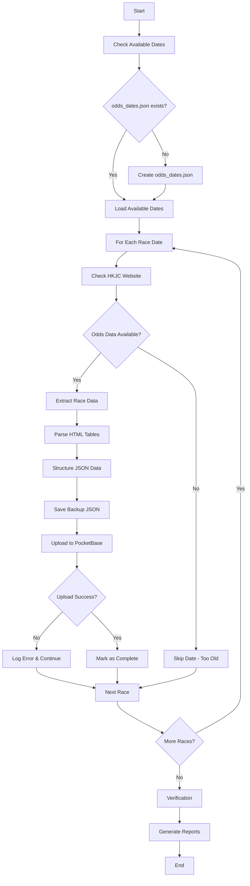

# HKJC Win Odds Trends - Process Flow

## 🔄 Complete Extraction & Upload Workflow



## 📊 Data Flow Architecture

```
┌─────────────────┐    ┌──────────────────┐    ┌─────────────────┐
│   HKJC Website  │    │  Extraction      │    │  Local Storage  │
│                 │───▶│  Scripts         │───▶│                 │
│ bet.hkjc.com    │    │                  │    │ win_odds_data/  │
│ 獨贏賠率走勢     │    │ Playwright +     │    │ JSON Backups    │
└─────────────────┘    │ BeautifulSoup    │    └─────────────────┘
                       └──────────────────┘              │
                                 │                       │
                                 ▼                       ▼
                       ┌──────────────────┐    ┌─────────────────┐
                       │   PocketBase     │    │  Verification   │
                       │   Database       │    │  & Reports      │
                       │                  │    │                 │
                       │ race_odds        │    │ Status Reports  │
                       │ Collection       │    │ Error Logs      │
                       └──────────────────┘    └─────────────────┘
```

## 🎯 Extraction Process Steps

### 1. Pre-Extraction Setup
```bash
# Environment Check
✅ .env configuration
✅ PocketBase connection
✅ Playwright browser setup
✅ Output directory creation
```

### 2. Date Discovery
```bash
# Load Reference Dates
📅 Read odds_dates.json
📋 Validate date format
🔍 Check date availability
⏰ Filter by time range
```

### 3. Race Extraction Loop
```bash
# For Each Race Date
🏇 Determine venue (ST/HV)
🔢 Get total race count
📊 Extract each race (R1-R12)
💾 Save JSON backup
📤 Upload to PocketBase
```

### 4. Data Processing
```bash
# HTML to JSON Conversion
🔍 Find odds tables
📋 Extract horse data
⏰ Parse timestamps
🏆 Structure win odds trends
✅ Validate data quality
```

### 5. Upload & Verification
```bash
# PocketBase Operations
🔐 Authenticate user
📤 Create race record
🔍 Verify upload success
📊 Update statistics
🧹 Cleanup duplicates
```

## 🗂️ File Organization Flow

```
Raw Extraction
     │
     ▼
┌─────────────────────────────────────────┐
│           win_odds_data/                │
│                                         │
│ win_odds_trends_2025_06_26_ST_R1.json  │
│ win_odds_trends_2025_06_26_ST_R2.json  │
│ ...                                     │
│ win_odds_trends_2025_07_01_ST_R12.json │
│                                         │
│ README.md (Documentation)              │
└─────────────────────────────────────────┘
     │
     ▼
PocketBase Upload
     │
     ▼
┌─────────────────────────────────────────┐
│         race_odds Collection            │
│                                         │
│ Record 1: 2025-06-26 ST R1             │
│ Record 2: 2025-06-26 ST R2             │
│ ...                                     │
│ Record 72: 2025-07-01 ST R12           │
└─────────────────────────────────────────┘
```

## ⚙️ Configuration Management

### Environment Variables Flow
```
.env File
    │
    ├── POCKETBASE_URL ────────┐
    ├── POCKETBASE_EMAIL ──────┤
    ├── POCKETBASE_PASSWORD ───┤──▶ Authentication
    │                          │
    ├── OUTPUT_DIR ────────────┼──▶ File Storage
    │                          │
    ├── RACE_DATE ─────────────┤
    ├── RACECOURSE ────────────┤──▶ Manual Extraction
    └── TOTAL_RACES ───────────┘
```

### Reference Files Flow
```
odds_dates.json ──────┐
                      ├──▶ Date Selection ──▶ Extraction Loop
race_dates.json ──────┘
```

## 🔍 Quality Control Process

### Data Validation Pipeline
```
Raw HTML Data
     │
     ▼ Parse & Validate
Horse Count Check ──▶ ❌ Fail: Log Error
     │                 ↓
     ▼ ✅ Pass         Skip Race
Odds Format Check ──▶ ❌ Fail: Log Error  
     │                 ↓
     ▼ ✅ Pass         Skip Race
Timestamp Check ────▶ ❌ Fail: Log Error
     │                 ↓
     ▼ ✅ Pass         Skip Race
JSON Structure ────▶ ❌ Fail: Log Error
     │                 ↓
     ▼ ✅ Pass         Skip Race
Save & Upload ─────▶ ✅ Success
```

### Post-Upload Verification
```
PocketBase Record
     │
     ▼
Count Verification ──▶ Expected: 72 races
     │
     ▼
Duplicate Check ────▶ Remove duplicates
     │
     ▼
Venue Validation ───▶ Single venue per date
     │
     ▼
Data Integrity ─────▶ Complete horse data
     │
     ▼
Final Report ───────▶ ✅ Database Clean
```

## 🚨 Error Handling Flow

### Network Errors
```
HKJC Request ──▶ Timeout/Error ──▶ Retry (3x) ──▶ Skip Race ──▶ Log Error
```

### Data Parsing Errors
```
HTML Parse ──▶ No Tables Found ──▶ Log Warning ──▶ Skip Race
           ──▶ Invalid Format ───▶ Log Error ───▶ Skip Race
```

### Upload Errors
```
PocketBase ──▶ Auth Error ──▶ Retry Auth ──▶ Continue/Fail
           ──▶ Network Error ─▶ Retry (3x) ─▶ Save Local Only
           ──▶ Data Error ────▶ Log Error ──▶ Skip Upload
```

## 📈 Monitoring & Reporting

### Success Metrics
```
Extraction Rate = (Successful Races / Total Available Races) × 100%
Upload Rate = (Uploaded Records / Extracted Records) × 100%
Data Quality = (Valid Records / Total Records) × 100%
```

### Status Reports
```
Daily Report:
├── Races Extracted: X/Y
├── Upload Success: X/Y  
├── Errors: X
└── Data Quality: XX%

Weekly Summary:
├── Total Races: XXX
├── New Extractions: XX
├── Database Size: XXX records
└── Coverage: XX dates
```

## 🔄 Maintenance Workflow

### Weekly Tasks
1. **Check Available Dates**: Update `odds_dates.json`
2. **Run Extraction**: `python extract_all_odds_data.py`
3. **Verify Data**: `python verify_pocketbase_data.py`
4. **Clean Database**: Remove duplicates/invalid records
5. **Generate Reports**: Status and coverage reports

### Monthly Tasks
1. **Archive Old Data**: Backup JSON files
2. **Update Documentation**: Reflect any changes
3. **Performance Review**: Analyze extraction success rates
4. **System Maintenance**: Update dependencies

This process flow ensures reliable, automated extraction and upload of HKJC win odds trends data with comprehensive quality control and error handling.
